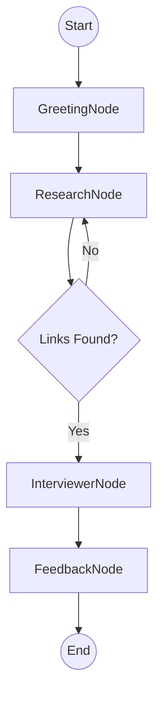

# Migration Blueprint: Python to LangChain/LangGraph

This document outlines the strategy for migrating the **Interview Agent** codebase from native Python (manual orchestration) to a structured **LangChain** and **LangGraph** architecture.

> [!NOTE]
> This is a planning document only. No code changes have been implemented yet.

## Why LangChain?
- **Standardized Interop**: Easier to swap models (Gemini, OpenAI, Anthropic).
- **LangGraph**: Replaces the manual `Orchestrator` with a stateful, cyclical graph for complex agentic workflows.
- **Built-in Memory**: Simplified session management using checkpointers.
- **Tooling**: Direct integration for Serper AI and Vector Stores.

---

## 1. Projected Component Refactoring

### Core LLM Configuration
Replace `google.generativeai` with `langchain_google_genai`.

```python
# From:
self.model = genai.GenerativeModel('gemini-2.5-flash-lite')
# To:
self.llm = ChatGoogleGenerativeAI(model="gemini-2.0-flash-lite")
```

### Tools (Serper & DB)
Existing services will be wrapped as LangChain `@tool` functions to be used by agents.

```python
@tool
def search_candidate_profiles(name: str):
    """Searches for LinkedIn and GitHub profiles via Serper AI."""
    # Existing Serper logic...
```

### State Management (LangGraph)
Replace the manual `session_store` in `app.py` with a **LangGraph State**.

```python
class AgentState(TypedDict):
    messages: Annotated[Sequence[BaseMessage], add_messages]
    cv_data: Dict
    unverified_skills: List[str]
    discovered_projects: List[Dict]
    current_topic: Optional[str]
```

---

## 2. Agent Graph Architecture

The `Orchestrator` logic will be migrated to a `StateGraph`.



---

## 3. Recommended Migration Phases

### Phase 1: Infrastructure Setup
- Update `requirements.txt` with `langchain`, `langchain-google-genai`, `langgraph`.
- Create a centralized `chain_factory.py` for LLM management.

### Phase 2: Services to Tools
- Convert `SerperService` and `Database` methods into LangChain tools.

### Phase 3: Agent & Graph Implementation
- Refactor individual Agents (`ResearchAgent`, `InterviewerAgent`, etc.) into Graph Nodes.
- Replace `Orchestrator` with a compiled `StateGraph`.

### Phase 4: Integration & Session Persistence
- Update `app.py` to invoke the graph.
- Implement a checkpointer (e.g., `SqliteSaver`) for persistent chat history.
